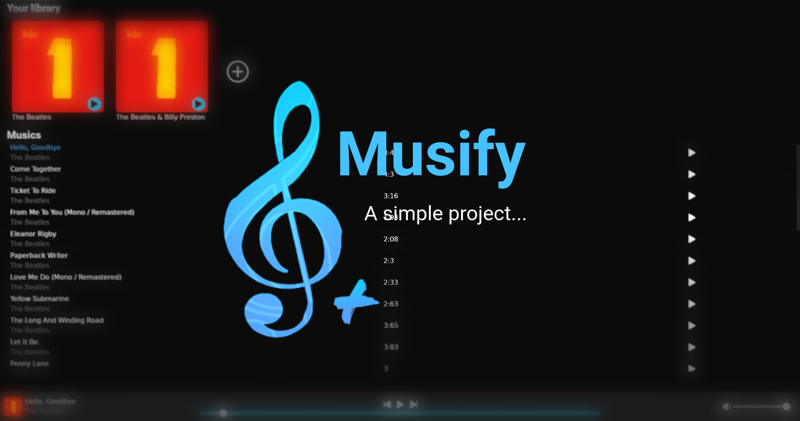

Musify - A simple project using my knowledge of Rust + Html + Js to create a really cool project xD

## Table of Contents
- [Introduction](#introduction)
- [Requirements](#requirements)
- [Run](#run)
- [Used Packages](#used-packages)
- [For the Front End](#for-the-front-end)

## Introduction
A simple project using my knowledge of Rust + Html + Js to create a really cool project xD

## Requirements
List the prerequisites required to compile and run the project:
- Rust (^1.83.0)
- Tauri Cli (^2.0.0)
- Tailwind Cli (^3.4.17)

## Run
1. Clone the repository:
   ```bash
   git clone https://github.com/user/project.git
   ```
2. Navigate to the project directory:
   ```bash
   cd musify
   ```
3. Execute:
   ```bash
   cargo tauri dev & npx tailwindcss -i ./global.css -o ./src/styles.css --watch
   ```

## Used Packages
```
- audiotags
- youtube_dl
- mp3-duration
- base64
```

## For the Front End
For icons, [Bootstrap Icons](https://icons.getbootstrap.com/) was used, and for CSS control, [Tailwindcss](https://tailwindcss.com/) was used.
For text font, the [Roboto](https://fonts.google.com/specimen/Roboto) font was used.

---

Feel free to adapt this template as needed!

